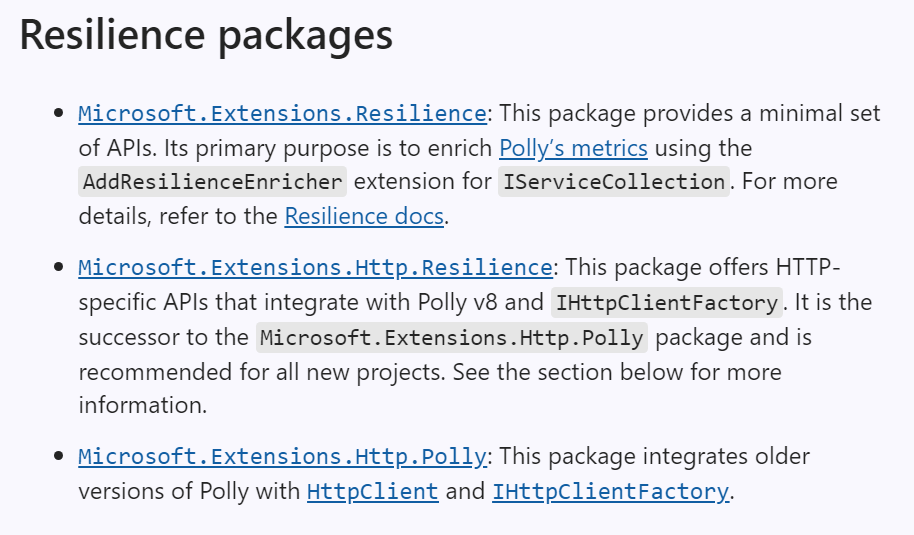
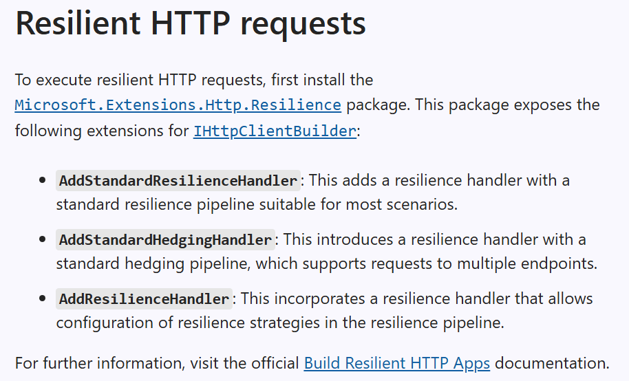
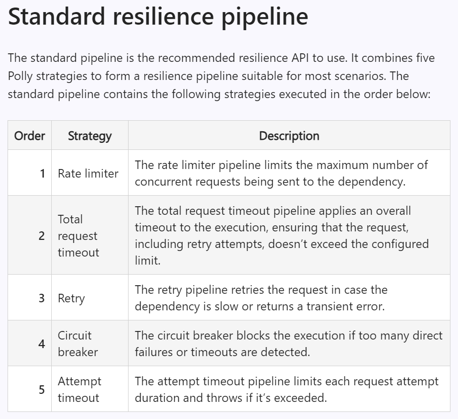
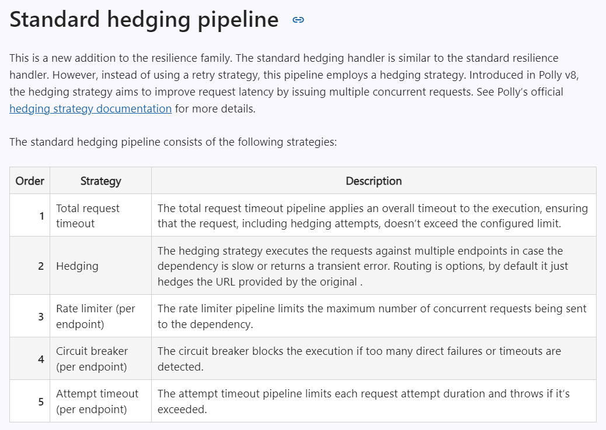

# Building resilient cloud services with .NET 8

MS Blog - `https://devblogs.microsoft.com/dotnet/building-resilient-cloud-services-with-dotnet-8/`

## Polly Project - `https://www.thepollyproject.org`

